# ZyraX Development Roadmap

**Visual documentation of system architecture and development workflow**

---

## System Architecture Overview

### High-Level Component Diagram

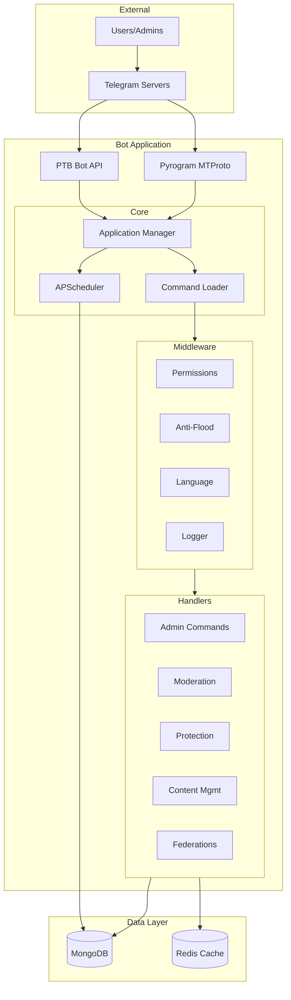

---

## Development Timeline

### 16-Week Implementation Schedule

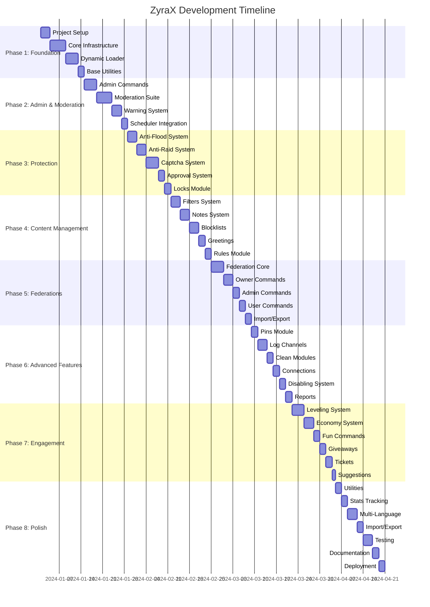

---

## Request Processing Flow

### Command Handler Execution Sequence

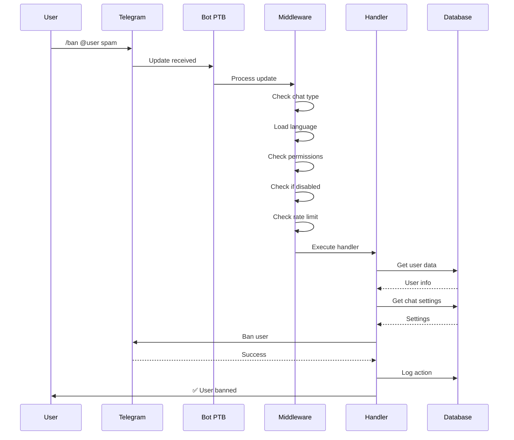

---

## Module Dependencies

### Component Relationship Diagram

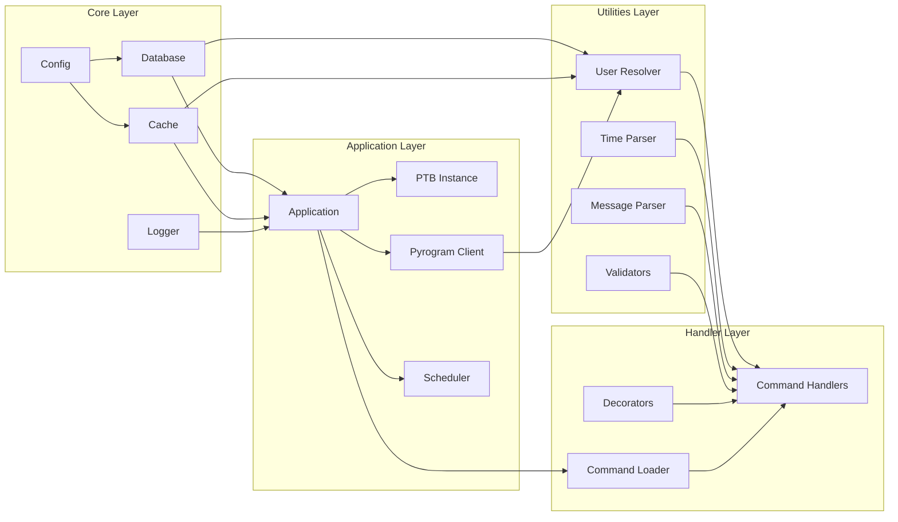

---

## Permission Verification Flow

### Authorization Check Process

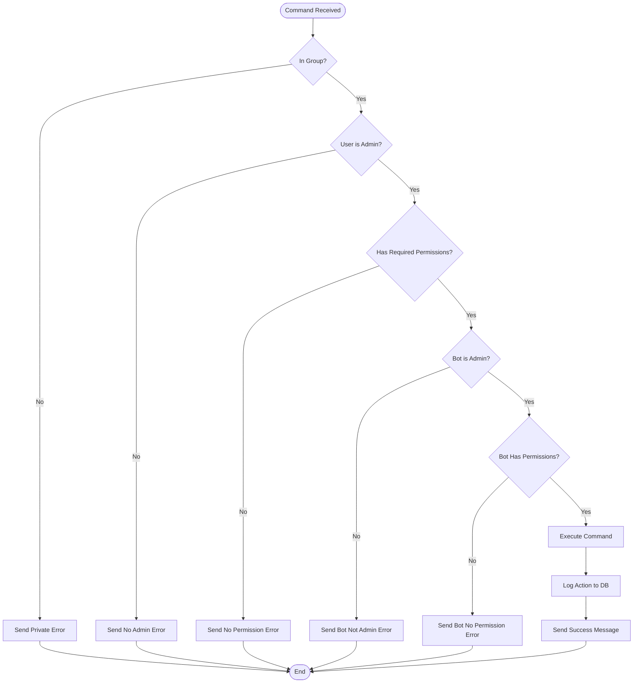

---

## User Resolution Strategy

### Multi-Tier Lookup Process

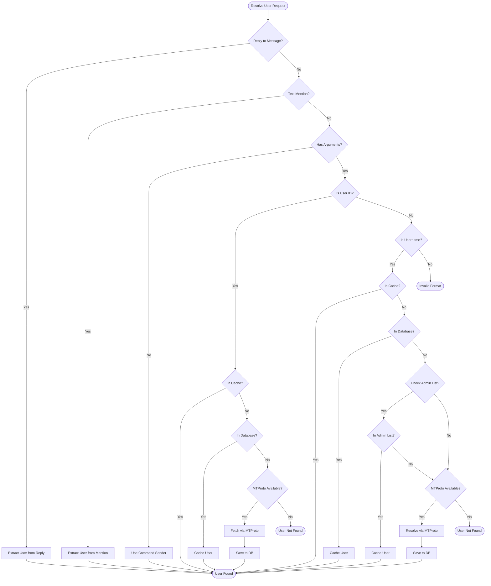

---

## Anti-Flood Detection

### State Machine Implementation

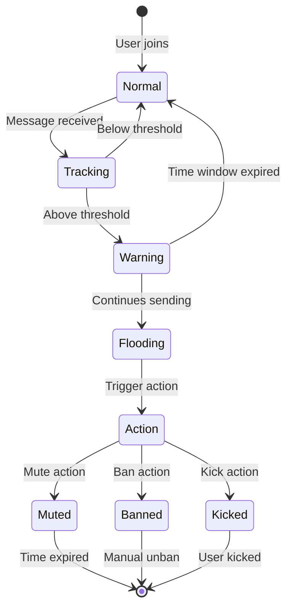

---

## Captcha Verification Flow

### New Member Verification Process

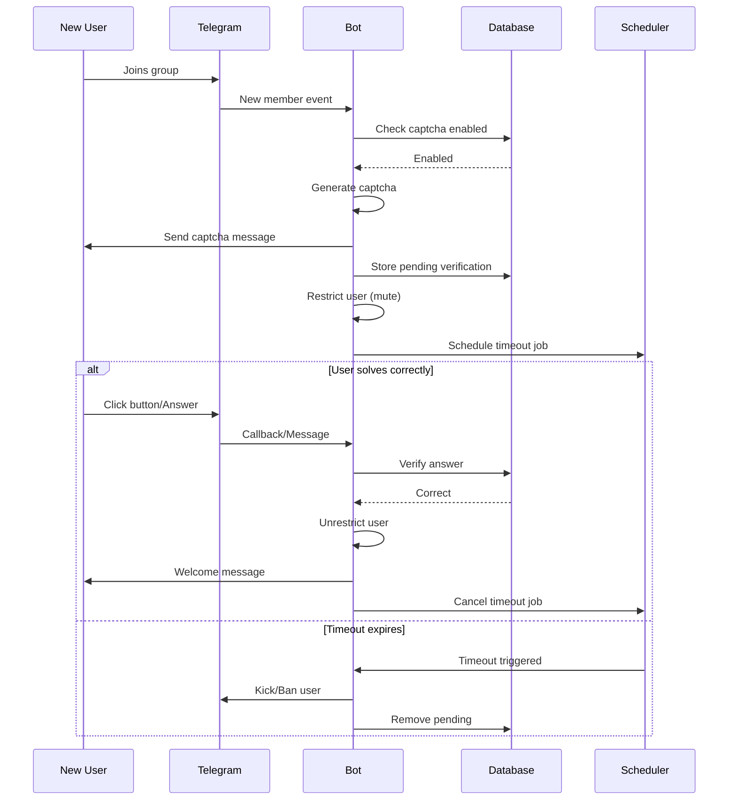

---

## Database Schema Relationships

### Entity Relationship Diagram

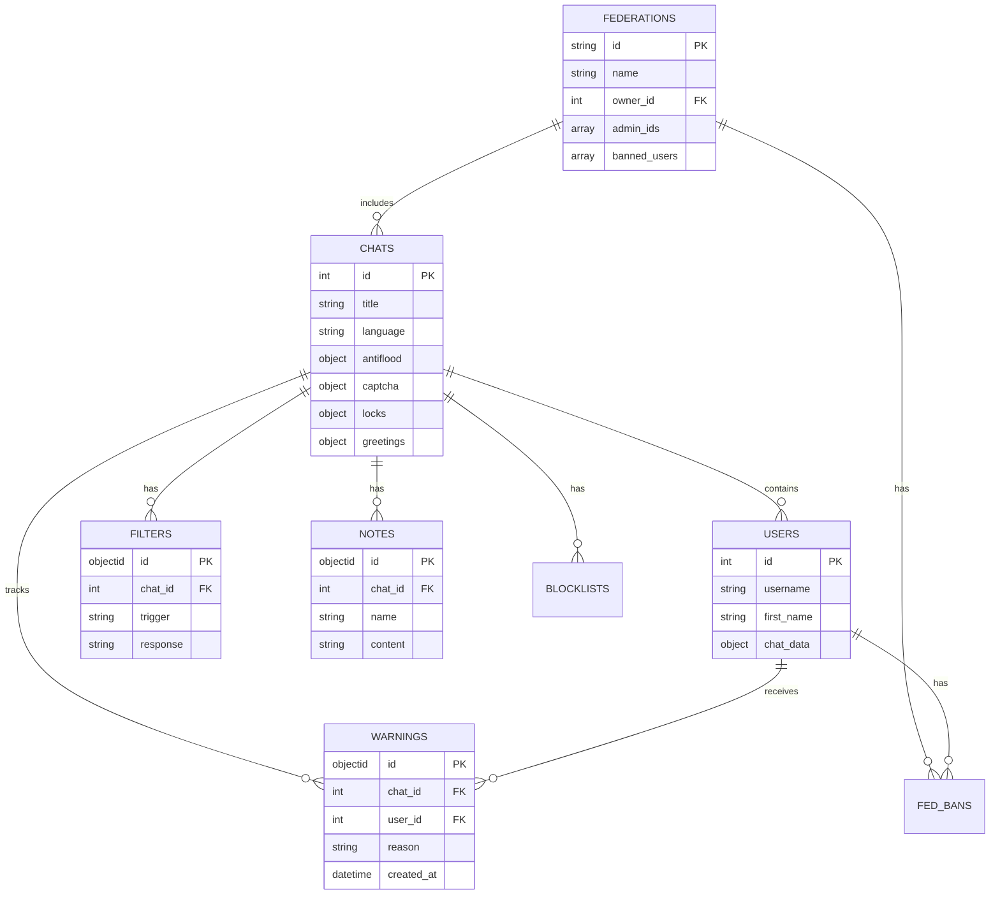

---

## Deployment Architecture

### Production Environment Structure

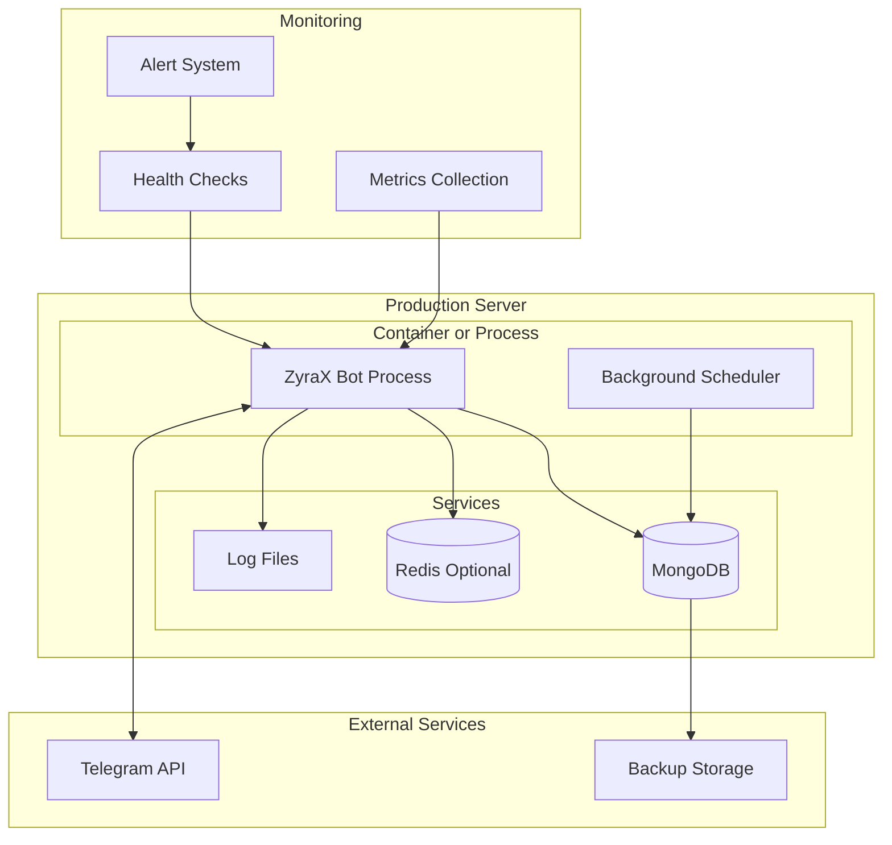

---

## Development Workflow

### Feature Implementation Process

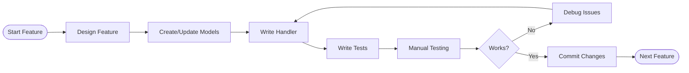

---

## Implementation Phases

### Phase Deliverables

#### Phase 1: Foundation (Weeks 1-2)
- Core infrastructure and dynamic loading
- Database connectivity and caching
- Basic utilities (user resolution, time parsing)
- Command registration system

#### Phase 2: Admin & Moderation (Weeks 3-4)
- Admin management (promote/demote)
- Moderation commands (ban/mute/kick)
- Warning system
- Message deletion (purge)

#### Phase 3: Protection Systems (Weeks 5-6)
- Anti-flood detection and enforcement
- Anti-raid protection
- Multi-mode captcha system
- User approval/whitelist
- Content locks (26+ types)

#### Phase 4: Content Management (Weeks 7-8)
- Custom filters with triggers
- Notes system with hashtags
- Welcome/goodbye messages
- Rules management
- Word blocklists

#### Phase 5: Federation System (Weeks 9-10)
- Cross-group ban synchronization
- Federation management
- Admin hierarchy
- Ban import/export

#### Phase 6: Advanced Features (Weeks 11-12)
- Pin management
- Log channels
- Report system
- Command disabling
- Chat connections

#### Phase 7: Engagement (Weeks 13-14)
- XP and leveling system
- Virtual economy
- Fun commands
- Giveaways
- Support tickets

#### Phase 8: Production (Weeks 15-16)
- Multi-language support
- Comprehensive testing
- Documentation completion
- Deployment configuration
- Performance optimization

---

## Architecture Principles

### Design Guidelines

**Modularity**
- Each feature module is self-contained
- Clear interfaces between components
- Minimal coupling between modules

**Async-First**
- Non-blocking I/O throughout
- Proper use of async/await
- Connection pooling for resources

**Performance**
- Multi-tier caching strategy
- Database query optimization
- Batch operations where applicable

**Reliability**
- Comprehensive error handling
- Graceful degradation
- Automatic retry mechanisms

**Observability**
- Structured logging
- Metrics collection
- Health monitoring

---

## Technical References

### External Documentation

- [python-telegram-bot Documentation](https://docs.python-telegram-bot.org/)
- [Pyrogram Documentation](https://docs.pyrogram.org/)
- [Motor (MongoDB) Documentation](https://motor.readthedocs.io/)
- [APScheduler Documentation](https://apscheduler.readthedocs.io/)
- [Telegram Bot API](https://core.telegram.org/bots/api)
- [Telegram MTProto API](https://core.telegram.org/api)

---

**Document Version:** 2.0  
**Last Updated:** October 2025  
**Status:** Production Implementation Complete